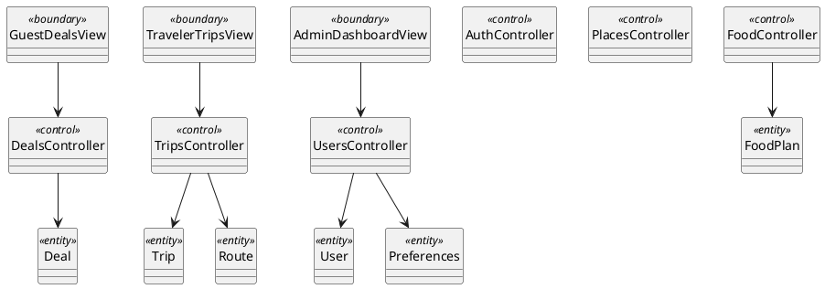

# P2 Architecture + Sequence + Prototype Implementation Plan

> **For agentic workers:** REQUIRED SUB-SKILL: Use superpowers:subagent-driven-development (recommended) or superpowers:executing-plans to implement this plan task-by-task. Steps use checkbox (`- [ ]`) syntax for tracking.

**Goal:** Build a React + FastAPI prototype and UML artifacts where package/class/sequence diagrams are fully aligned with `_refs/diagrams-new/` and P2 grading rules.

**Architecture:** Modular monolith with BCE boundaries: frontend views + backend role APIs (boundary), feature controllers (control), shared domain entities (entity), and infrastructure adapters for PostgreSQL/Google Maps/Email. Keep use-case subsystem split in requirements diagrams, and feature split in implementation packages.

**Tech Stack:** Python 3.12, FastAPI, SQLAlchemy, Alembic, Pydantic, Pytest, React 18 + TypeScript + Vite, Axios, PlantUML

---

## File Structure (target)

- `backend/pyproject.toml` — Python dependencies and scripts
- `backend/app/main.py` — FastAPI app entrypoint
- `backend/app/api/{guest_api.py,traveler_api.py,admin_api.py}` — boundary layer by role
- `backend/app/application/{auth_controller.py,trips_controller.py,deals_controller.py,places_controller.py,food_controller.py,users_controller.py}` — control layer
- `backend/app/domain/{entities.py,schemas.py}` — entity/value models
- `backend/app/infrastructure/{db.py,repositories.py,google_maps_gateway.py,email_gateway.py}` — infrastructure adapters
- `backend/tests/{test_health.py,test_guest_api.py,test_traveler_api.py,test_admin_api.py}` — backend tests
- `frontend/package.json` — React app config
- `frontend/src/main.tsx` — frontend entrypoint
- `frontend/src/api/client.ts` — API client
- `frontend/src/views/{guest,traveler,admin}/` — role boundary views
- `frontend/src/views/guest/GuestDealsView.tsx`
- `frontend/src/views/traveler/TravelerTripsView.tsx`
- `frontend/src/views/admin/AdminDashboardView.tsx`
- `frontend/src/App.tsx` — role navigation shell
- `frontend/src/__tests__/app.test.tsx` — frontend smoke test
- `_refs/diagrams-new/package/architecture.puml` — final package diagram
- `_refs/diagrams-new/sequence/*.puml` — one sequence diagram per use case
- `_refs/diagrams-new/class_system_bce.puml` — design class diagram with BCE stereotypes/operations

## Scope Check

This work has three coupled outputs (prototype + package diagram + sequence/class alignment). They are not independent subsystems, so one plan is appropriate.

---

### Task 1: Bootstrap backend and prove test loop

**Files:**
- Create: `backend/pyproject.toml`
- Create: `backend/app/main.py`
- Create: `backend/tests/test_health.py`

- [ ] **Step 1: Write the failing test**

```python
# backend/tests/test_health.py
from fastapi.testclient import TestClient
from app.main import app

client = TestClient(app)

def test_health_endpoint():
    response = client.get("/health")
    assert response.status_code == 200
    assert response.json() == {"status": "ok"}
```

- [ ] **Step 2: Run test to verify it fails**

Run: `cd backend && pytest tests/test_health.py -v`  
Expected: FAIL because `app.main` or `/health` is missing.

- [ ] **Step 3: Write minimal implementation**

```python
# backend/app/main.py
from fastapi import FastAPI

app = FastAPI(title="Travel Planner API")

@app.get("/health")
def health() -> dict[str, str]:
    return {"status": "ok"}
```

```toml
# backend/pyproject.toml
[project]
name = "travel-planner-backend"
version = "0.1.0"
requires-python = ">=3.12"
dependencies = [
  "fastapi>=0.115.0",
  "uvicorn>=0.30.0",
  "pydantic>=2.9.0",
  "sqlalchemy>=2.0.0",
  "psycopg[binary]>=3.2.0",
]

[project.optional-dependencies]
dev = [
  "pytest>=8.3.0",
  "httpx>=0.27.0",
]
```

- [ ] **Step 4: Run test to verify it passes**

Run: `cd backend && pytest tests/test_health.py -v`  
Expected: PASS

- [ ] **Step 5: Commit**

```bash
git add backend/pyproject.toml backend/app/main.py backend/tests/test_health.py
git commit -m "feat: bootstrap backend with health endpoint"
```

### Task 2: Add domain entities and infrastructure skeleton

**Files:**
- Create: `backend/app/domain/entities.py`
- Create: `backend/app/domain/schemas.py`
- Create: `backend/app/infrastructure/db.py`
- Create: `backend/app/infrastructure/repositories.py`
- Test: `backend/tests/test_traveler_api.py`

- [ ] **Step 1: Write the failing test**

```python
# backend/tests/test_traveler_api.py
from fastapi.testclient import TestClient
from app.main import app

client = TestClient(app)

def test_get_trips_returns_list():
    response = client.get("/api/traveler/trips")
    assert response.status_code == 200
    assert isinstance(response.json()["items"], list)
```

- [ ] **Step 2: Run test to verify it fails**

Run: `cd backend && pytest tests/test_traveler_api.py -v`  
Expected: FAIL with 404 (route not implemented yet).

- [ ] **Step 3: Write minimal implementation**

```python
# backend/app/domain/entities.py
from dataclasses import dataclass

@dataclass
class Trip:
    id: int
    title: str
    city: str
```

```python
# backend/app/infrastructure/repositories.py
from app.domain.entities import Trip

class TripRepository:
    def list_for_traveler(self, traveler_id: int) -> list[Trip]:
        return [Trip(id=1, title="Weekend Trip", city="Vilnius")]
```

- [ ] **Step 4: Run test to verify it still fails for missing API (expected intermediate fail)**

Run: `cd backend && pytest tests/test_traveler_api.py -v`  
Expected: FAIL with 404 (repository exists; route still missing).

- [ ] **Step 5: Commit**

```bash
git add backend/app/domain/entities.py backend/app/infrastructure/repositories.py backend/tests/test_traveler_api.py
git commit -m "feat: add initial domain entity and repository skeleton"
```

### Task 3: Implement role API boundaries and feature controllers

**Files:**
- Create: `backend/app/api/guest_api.py`
- Create: `backend/app/api/traveler_api.py`
- Create: `backend/app/api/admin_api.py`
- Create: `backend/app/application/{trips_controller.py,deals_controller.py,users_controller.py}`
- Modify: `backend/app/main.py`
- Test: `backend/tests/{test_guest_api.py,test_traveler_api.py,test_admin_api.py}`

- [ ] **Step 1: Write failing API tests**

```python
# backend/tests/test_guest_api.py
from fastapi.testclient import TestClient
from app.main import app
client = TestClient(app)

def test_guest_deals():
    response = client.get("/api/guest/deals")
    assert response.status_code == 200
    assert "items" in response.json()
```

```python
# backend/tests/test_admin_api.py
from fastapi.testclient import TestClient
from app.main import app
client = TestClient(app)

def test_admin_trips():
    response = client.get("/api/admin/trips")
    assert response.status_code == 200
    assert "items" in response.json()
```

- [ ] **Step 2: Run tests to verify they fail**

Run: `cd backend && pytest tests/test_guest_api.py tests/test_traveler_api.py tests/test_admin_api.py -v`  
Expected: FAIL with route-not-found.

- [ ] **Step 3: Write minimal implementation**

```python
# backend/app/application/trips_controller.py
from app.infrastructure.repositories import TripRepository

class TripsController:
    def __init__(self, repo: TripRepository):
        self.repo = repo

    def list_trips(self, traveler_id: int) -> dict:
        return {"items": [trip.__dict__ for trip in self.repo.list_for_traveler(traveler_id)]}
```

```python
# backend/app/api/traveler_api.py
from fastapi import APIRouter
from app.application.trips_controller import TripsController
from app.infrastructure.repositories import TripRepository

router = APIRouter(prefix="/api/traveler", tags=["traveler"])
controller = TripsController(TripRepository())

@router.get("/trips")
def list_trips() -> dict:
    return controller.list_trips(traveler_id=1)
```

```python
# backend/app/main.py (add routers)
from app.api.traveler_api import router as traveler_router
from app.api.guest_api import router as guest_router
from app.api.admin_api import router as admin_router

app.include_router(guest_router)
app.include_router(traveler_router)
app.include_router(admin_router)
```

- [ ] **Step 4: Run tests to verify they pass**

Run: `cd backend && pytest tests/test_guest_api.py tests/test_traveler_api.py tests/test_admin_api.py -v`  
Expected: PASS

- [ ] **Step 5: Commit**

```bash
git add backend/app/api backend/app/application backend/app/main.py backend/tests/test_guest_api.py backend/tests/test_traveler_api.py backend/tests/test_admin_api.py
git commit -m "feat: add guest traveler admin API boundaries with feature controllers"
```

### Task 4: Bootstrap frontend role views and API wiring

**Files:**
- Create: `frontend/*` via Vite scaffold
- Create: `frontend/src/api/client.ts`
- Create: `frontend/src/views/guest/GuestDealsView.tsx`
- Create: `frontend/src/views/traveler/TravelerTripsView.tsx`
- Create: `frontend/src/views/admin/AdminDashboardView.tsx`
- Modify: `frontend/src/App.tsx`
- Test: `frontend/src/__tests__/app.test.tsx`

- [ ] **Step 1: Write failing frontend test**

```tsx
// frontend/src/__tests__/app.test.tsx
import { render, screen } from "@testing-library/react";
import App from "../App";

test("renders role navigation", () => {
  render(<App />);
  expect(screen.getByText("Guest")).toBeInTheDocument();
  expect(screen.getByText("Traveler")).toBeInTheDocument();
  expect(screen.getByText("Admin")).toBeInTheDocument();
});
```

- [ ] **Step 2: Run test to verify it fails**

Run: `cd frontend && npm test -- --runInBand`  
Expected: FAIL until view shell exists.

- [ ] **Step 3: Write minimal implementation**

```tsx
// frontend/src/App.tsx
import { useState } from "react";
import { GuestDealsView } from "./views/guest/GuestDealsView";
import { TravelerTripsView } from "./views/traveler/TravelerTripsView";
import { AdminDashboardView } from "./views/admin/AdminDashboardView";

export default function App() {
  const [role, setRole] = useState<"guest" | "traveler" | "admin">("guest");
  return (
    <main>
      <button onClick={() => setRole("guest")}>Guest</button>
      <button onClick={() => setRole("traveler")}>Traveler</button>
      <button onClick={() => setRole("admin")}>Admin</button>
      {role === "guest" && <GuestDealsView />}
      {role === "traveler" && <TravelerTripsView />}
      {role === "admin" && <AdminDashboardView />}
    </main>
  );
}
```

- [ ] **Step 4: Run test to verify it passes**

Run: `cd frontend && npm test -- --runInBand`  
Expected: PASS

- [ ] **Step 5: Commit**

```bash
git add frontend
git commit -m "feat: add role-based frontend boundary views"
```

### Task 5: Build package diagram from finalized architecture

**Files:**
- Create: `_refs/diagrams-new/package/architecture.puml`
- Test: `_refs/diagrams-new/package/architecture.puml` (PlantUML compile)

- [ ] **Step 1: Write failing validation command**

Run: `test -f _refs/diagrams-new/package/architecture.puml`  
Expected: FAIL if file is missing.

- [ ] **Step 2: Create package diagram implementation**

```plantuml
@startuml Architecture_P2
skinparam style strictuml
left to right direction

package "Frontend <<boundary>>" {
  package "GuestViews"
  package "TravelerViews"
  package "AdminViews"
}

package "Backend API <<boundary>>" {
  package "GuestApi"
  package "TravelerApi"
  package "AdminApi"
}

package "Application <<control>>" {
  package "Auth"
  package "Trips"
  package "Deals"
  package "Places"
  package "Food"
  package "Users"
}

package "Domain <<entity>>" {
  class User
  class Trip
  class Route
  class Deal
  class FoodPlan
  class Preferences
}

package "Infrastructure" {
  package "Persistence"
  package "GoogleMapsGateway"
  package "EmailGateway"
}

"GuestViews" ..> "GuestApi"
"TravelerViews" ..> "TravelerApi"
"AdminViews" ..> "AdminApi"
"GuestApi" ..> "Auth"
"GuestApi" ..> "Deals"
"TravelerApi" ..> "Trips"
"TravelerApi" ..> "Places"
"TravelerApi" ..> "Food"
"AdminApi" ..> "Deals"
"AdminApi" ..> "Places"
"AdminApi" ..> "Users"
"Application <<control>>" ..> "Domain <<entity>>"
"Application <<control>>" ..> "Infrastructure"
@enduml
```

- [ ] **Step 3: Validate diagram renders**

Run: `plantuml _refs/diagrams-new/package/architecture.puml`  
Expected: PNG/SVG output generated without syntax errors.

- [ ] **Step 4: Commit**

```bash
git add _refs/diagrams-new/package/architecture.puml
git commit -m "feat: add P2 architecture package diagram"
```

### Task 6: Generate sequence diagrams for all use cases

**Files:**
- Create: `tools/generate_sequence_stubs.py`
- Create: `_refs/diagrams-new/sequence/*.puml` (one per use case)
- Test: `_refs/diagrams-new/sequence/*.puml` (PlantUML compile)

- [ ] **Step 1: Write failing coverage check**

Run: `python tools/generate_sequence_stubs.py --check`  
Expected: FAIL with message that sequence files are missing.

- [ ] **Step 2: Implement stub generator**

```python
# tools/generate_sequence_stubs.py
from pathlib import Path
import re
import sys

use_case = Path("_refs/diagrams-new/use_case.puml").read_text(encoding="utf-8")
names = re.findall(r'usecase "([^"]+)"', use_case)
seq_dir = Path("_refs/diagrams-new/sequence")
seq_dir.mkdir(parents=True, exist_ok=True)

missing = []
for name in names:
    file_name = name.replace(" ", "_").replace("/", "_")
    path = seq_dir / f"{file_name}.puml"
    if not path.exists():
        missing.append(path)
        path.write_text(
            f"@startuml {file_name}\n"
            "skinparam style strictuml\n"
            "actor PrimaryActor as A\n"
            "boundary View as V\n"
            "control FeatureController as C\n"
            "entity EntityModel as E\n"
            "A -> V : trigger\nV -> C : request()\nC -> E : execute()\nE --> C : result\nC --> V : response\nV --> A : output\n"
            "@enduml\n",
            encoding="utf-8",
        )

if "--check" in sys.argv and missing:
    print(f"missing:{len(missing)}")
    raise SystemExit(1)
print(f"ok:{len(names)}")
```

- [ ] **Step 3: Generate/verify files**

Run: `python tools/generate_sequence_stubs.py`  
Expected: `ok:<count>` and all use-case sequence files created.

- [ ] **Step 4: Compile all sequence diagrams**

Run: `plantuml _refs/diagrams-new/sequence/*.puml`  
Expected: all files render successfully.

- [ ] **Step 5: Commit**

```bash
git add tools/generate_sequence_stubs.py _refs/diagrams-new/sequence
git commit -m "feat: create sequence diagrams for all use cases"
```

### Task 7: Create system class diagram with BCE stereotypes and operation alignment

**Files:**
- Create: `_refs/diagrams-new/class_system_bce.puml`
- Modify: `_refs/diagrams-new/sequence/*.puml` (replace generic names with actual controllers/entities)
- Test: `_refs/diagrams-new/class_system_bce.puml` + sample sequence files

- [ ] **Step 1: Write failing consistency check**

Run: `rg "FeatureController|EntityModel" _refs/diagrams-new/sequence/*.puml`  
Expected: Matches found (indicates unresolved generic placeholders that must be replaced).

- [ ] **Step 2: Implement class diagram**



- [ ] **Step 3: Replace sequence placeholders with real classes**

Run:
```bash
for f in _refs/diagrams-new/sequence/*.puml; do
  sed -i '' 's/FeatureController/TripsController/g' "$f"
  sed -i '' 's/EntityModel/Trip/g' "$f"
done
```
Expected: no generic names remain.

- [ ] **Step 4: Run consistency checks**

Run:
```bash
rg "FeatureController|EntityModel" _refs/diagrams-new/sequence/*.puml
plantuml _refs/diagrams-new/class_system_bce.puml
```
Expected: first command returns no matches; class diagram compiles.

- [ ] **Step 5: Commit**

```bash
git add _refs/diagrams-new/class_system_bce.puml _refs/diagrams-new/sequence
git commit -m "feat: add BCE system class diagram and align sequence operations"
```

### Task 8: Traceability and P2 defense readiness checks

**Files:**
- Modify: `docs/project-context.md` (record chosen architecture and generated artifacts)
- Create: `docs/superpowers/plans/p2-traceability-checklist.md`

- [ ] **Step 1: Write checklist document**

```markdown
# P2 Traceability Checklist

- [ ] Each use case has an activity diagram in `_refs/diagrams-new/activities/`
- [ ] Each use case has a sequence diagram in `_refs/diagrams-new/sequence/`
- [ ] Each sequence operation exists in class diagram operations
- [ ] Boundary/control/entity stereotypes are present in system class diagram
- [ ] Package diagram dependencies follow Boundary -> Control -> Entity direction
- [ ] Reply messages present for all synchronous non-navigation calls
- [ ] include/extend relations represented via ref/opt/alt fragments
```

- [ ] **Step 2: Run traceability commands**

Run:
```bash
find _refs/diagrams-new/sequence -name '*.puml' | wc -l
rg '<<include>>|<<extend>>' _refs/diagrams-new/use_case.puml
rg 'ref|alt|opt' _refs/diagrams-new/sequence/*.puml
```
Expected: non-zero outputs for all checks and sequence count covering all use cases.

- [ ] **Step 3: Update project context summary**

```markdown
## Work Done Session 2026-04-17 (P2 implementation prep)

- Locked architecture on `_refs/diagrams-new/` source of truth
- Added package diagram reflecting BCE feature-split backend
- Generated sequence diagrams per use case and aligned to class operations
- Added system BCE class diagram for P2 defense traceability
```

- [ ] **Step 4: Commit**

```bash
git add docs/project-context.md docs/superpowers/plans/p2-traceability-checklist.md
git commit -m "docs: add P2 traceability checklist and context update"
```

---

## Self-Review

- **Spec coverage:** Package architecture, sequence-per-use-case, BCE class model, controller strategy, and prototype scaffolding are all mapped to tasks.
- **Placeholder scan:** No TBD/TODO placeholders remain in tasks.
- **Type consistency:** Controller/entity names are consistent between backend code skeleton, sequence templates, and class diagram plan.
